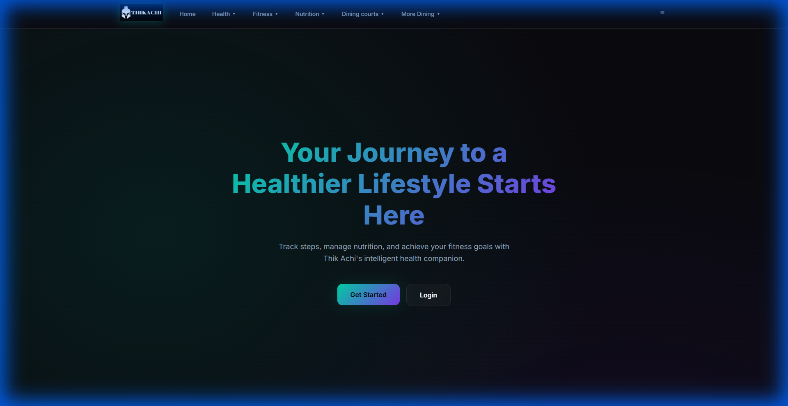

# Thik Achi - Comprehensive Health & Wellness Platform



## 🚀 Overview

**Thik Achi** is a full-featured MERN stack application designed to help users take control of their health. From personalized meal planning and macro tracking to exercise logging and sleep analysis, Thik Achi provides a unified dashboard for holistic wellness.

Built with a premium **Dark Glassmorphism** design system, the application offers a modern, responsive, and engaging user experience.

## ✨ Key Features

### 🍎 Nutrition & Clean Eating
- **Smart Food Tracker**: Log meals with detailed macro (Protein, Carbs, Fat) and micro nutrient breakdowns.
- **Dietary Preferences**: Set restrictions (Vegan, Gluten-Free, etc.) and get tailored recommendations.
- **Saved Favorites**: Quickly access your go-to meals and recipes.

### 🏃 Fitness & Activity
- **Holistic Logging**: Dedicated trackers for Weight Lifting, Cardio, and other activities.
- **Visual Progress**: Dynamic charts ensuring you stay on top of your volume and consistency.
- **Exercise History**: Review past workouts to track progressive overload.

### 🩺 Health & Lifestyle
- **Other Health Metrics**: Track Weight trends, Sleep quality, Water intake, and Supplement stacks.
- **Goal Setting**: Define high-level and low-level fitness goals.
- **Report System**: Built-in feedback mechanism for support.

### 🎨 Modern UI/UX
- **Glassmorphism Design**: Translucent interfaces with background blurs for a futuristic feel.
- **Responsive Layouts**: Optimized for all screen sizes using CSS Grid and Flexbox.
- **Interactive Elements**: Smooth transitions and hover effects powered by Framer Motion.

## 🛠️ Technology Stack

### Frontend
- **Framework**: React.js (Vite)
- **Styling**: SCSS (Modules & Global), Glassmorphism CSS
- **UI Library**: Material UI (MUI), MUI X Charts
- **State Management**: React Context API
- **Animations**: Framer Motion
- **Routing**: React Router DOM

### Backend
- **Runtime**: Node.js
- **Framework**: Express.js
- **Database**: MongoDB (Mongoose Schema)
- **Authentication**: JWT (JSON Web Tokens) & Crypto-js
- **Security**: Password Encryption (AES)

## 📦 Installation & Setup

### Prerequisites
- Node.js (v14+)
- MongoDB (Atlas or Local)

### 1. Clone the Repository
```bash
git clone https://github.com/yourusername/thik-achi.git
cd thik-achi
```

### 2. Backend Setup
```bash
cd backend
npm install
```
Create a `.env` file in `backend/`:
```env
MONGO_URL=your_mongodb_connection_string
SECRET_KEY=your_secret_key
```
Start the server:
```bash
npm start
```

### 3. Frontend Setup
```bash
cd frontend
npm install
npm run dev
```

### 4. Usage
Visit `http://localhost:5173` (or the port shown in your terminal) to view the application.

## 🤝 Contributing
Contributions are welcome! Please fork the repository and submit a pull request.

## 📄 License
This project is licensed under the MIT License.
